# Personal Portfolio

A modern, responsive personal portfolio website built with **React**, **TypeScript**, and **Tailwind CSS**. It showcases your projects, skills, education, and experience with smooth UI interactions and clean visuals.

---

## ✨ Features

- Responsive and mobile-first design
- Fast performance with Vite bundler
- Styled using Tailwind CSS and Radix UI
- Well-organized modular component structure
- Contact form with backend integration
- SEO optimized with proper meta tags
- Framer Motion animations
- Dark/Light theme toggle with system preference detection
- Persistent theme selection using local storage

---

## 🖼️ Screenshots

<p align="center">
  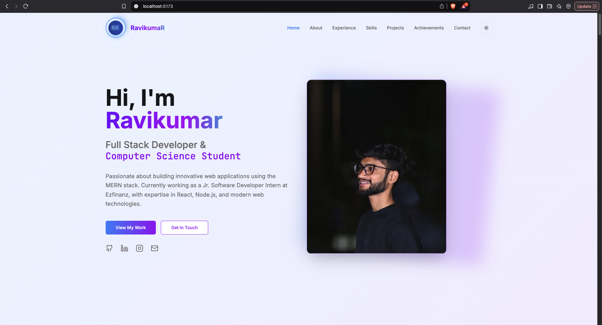
  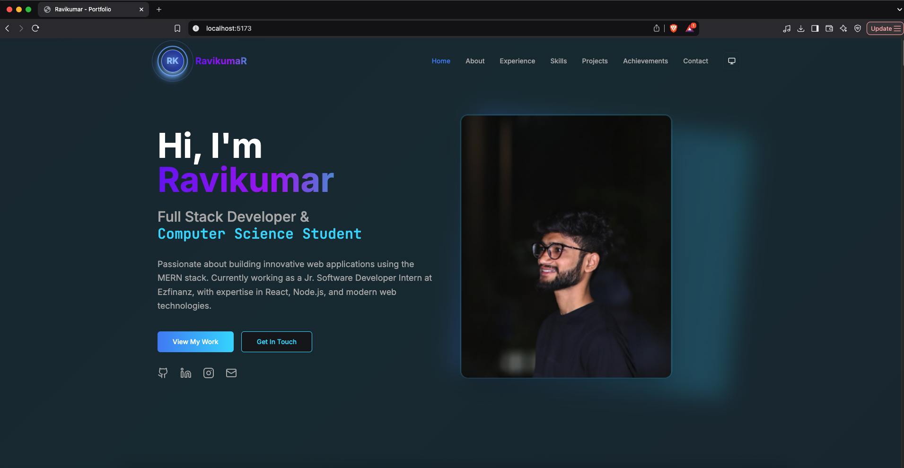
  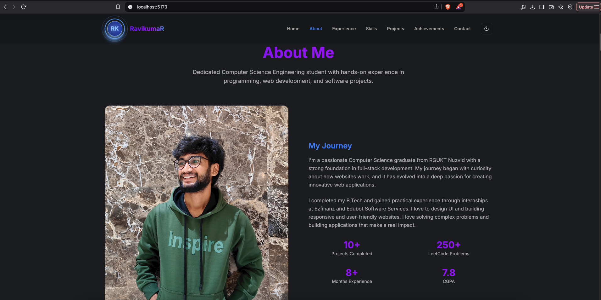
  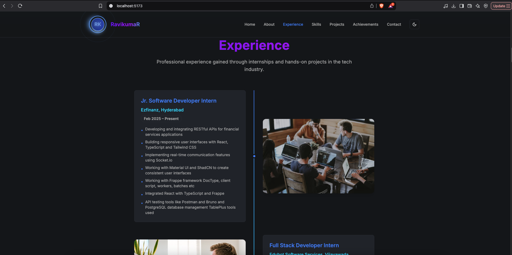
  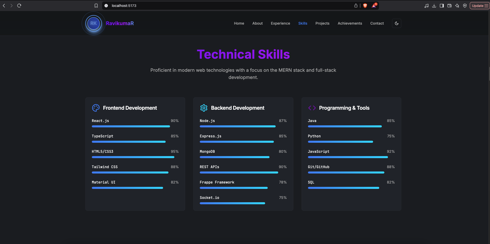
  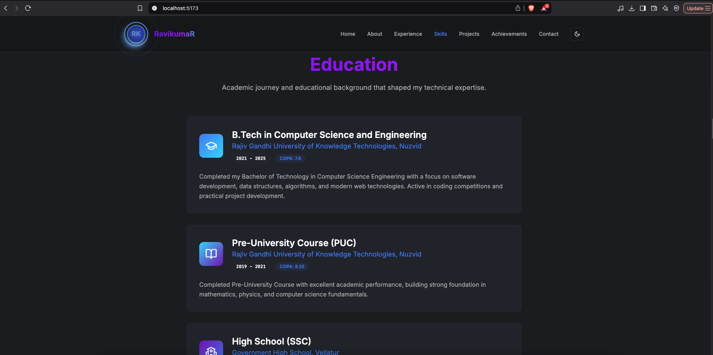
  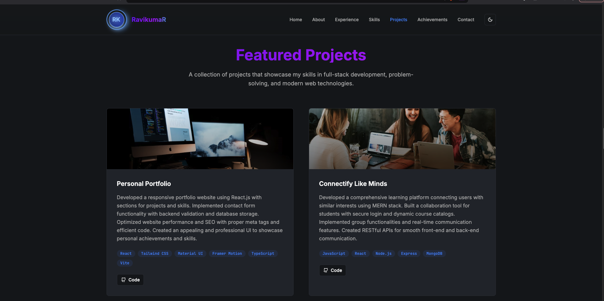
  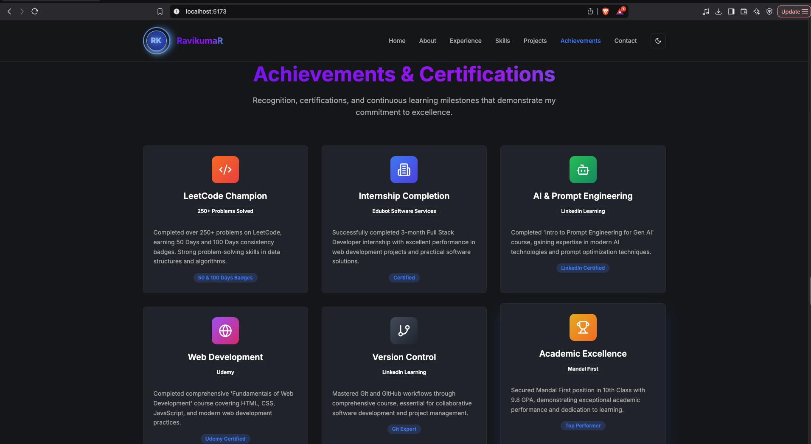
  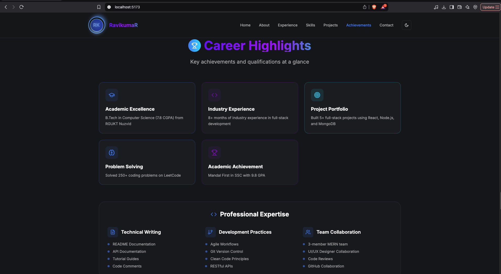
  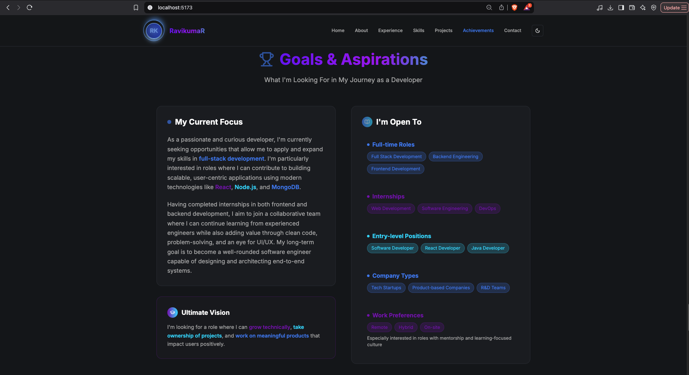
  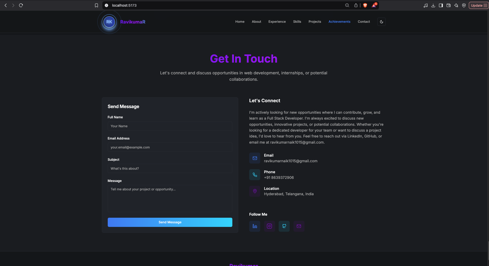
</p>

---

## 🧩 Tech Stack

### Frontend
- React 18
- TypeScript
- Tailwind CSS
- Radix UI
- React Query
- Framer Motion
- React Hook Form + Zod
- Vite
- next-themes (for theme management)

---

## 📁 Project Structure

```
Portfolio/
├── frontend/
│   ├── index.html
│   └── src/
│       ├── App.tsx
│       ├── main.tsx
│       ├── index.css
│       ├── pages/
│       ├── components/
│       │   ├── navigation.tsx    
│       │   └── ThemeProvider.tsx
│       │   └──.......
│       ├── hooks/
│       │   └── useTheme.ts        # Custom theme hook
│       ├── lib/
│       └── assets/
│           ├── profile/
│           ├── resume/
│           └── screenshort/
```

---

## 🚀 Getting Started

### Installation

1. Clone the repository
```bash
git clone https://github.com/Ravikumar1032/Portfolio.git
cd Portfolio
```

2. Install dependencies
```bash
npm install
```

3. Start development server
```bash
npm run dev
```

---

## 📜 Scripts

| Command         | Description              |
| --------------- | ------------------------ |
| `npm run dev`   | Start development server |
| `npm run build` | Build for production     |

---

## 📄 Resume

📂 [`src/assets/resume/Ravikumar_Resume.pdf`](./src/assets/resume/Ravikumar_Resume.pdf)

---

## 📬 Contact

For any queries, feedback, or collaboration opportunities, reach out:

📧 **[ravikumarnaik1015@gmail.com](mailto:ravikumarnaik1015@gmail.com)**

---

© 2025 Mudhavath Ravikumar Naik. All rights reserved.
